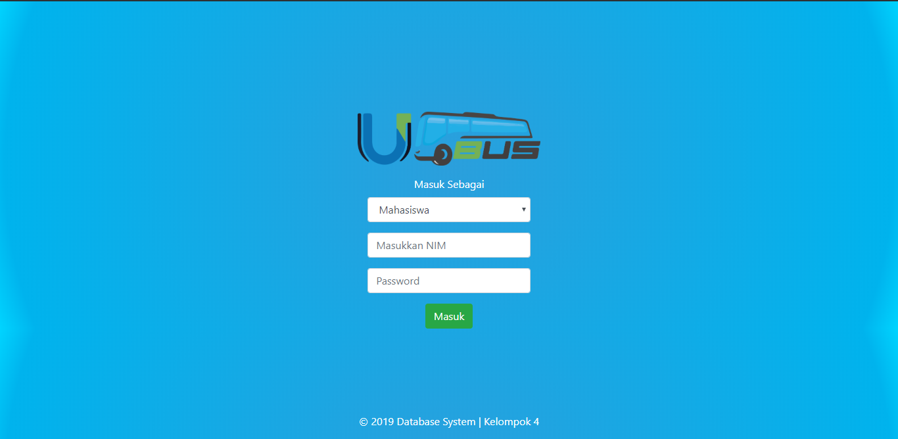
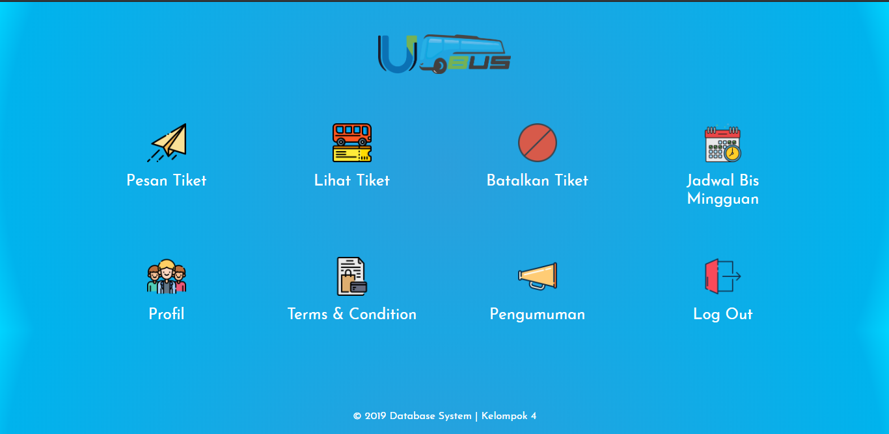
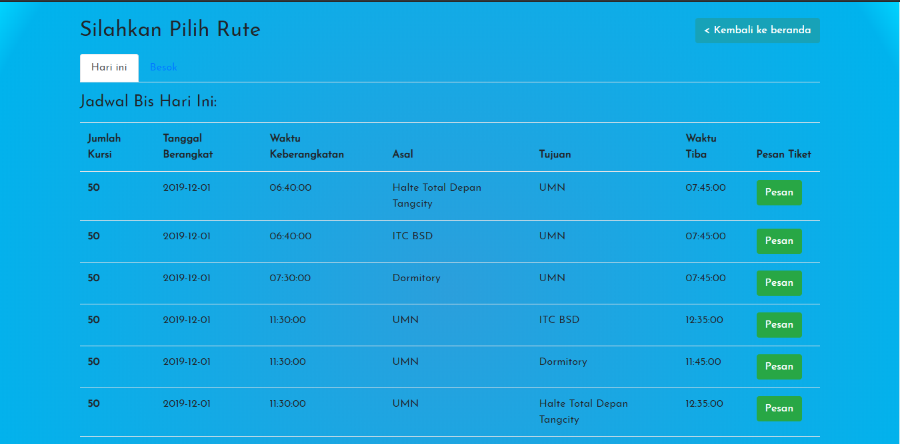
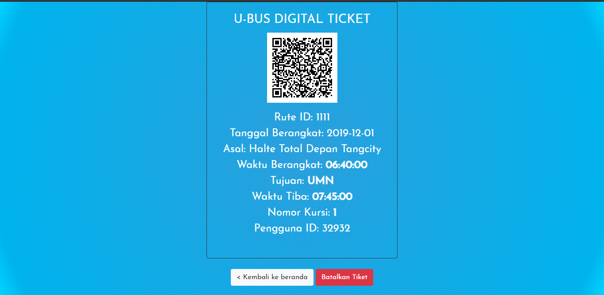
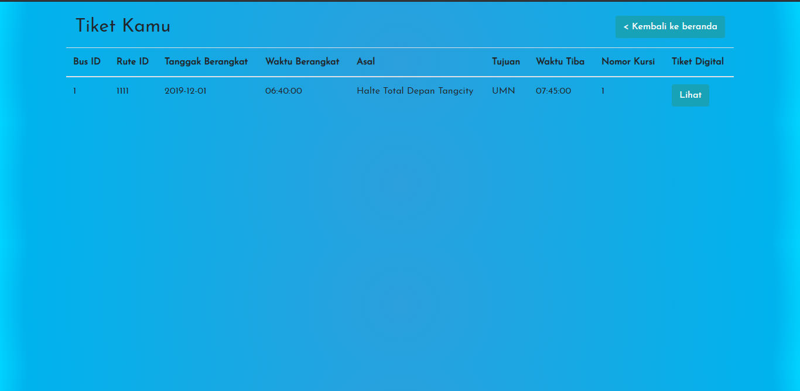
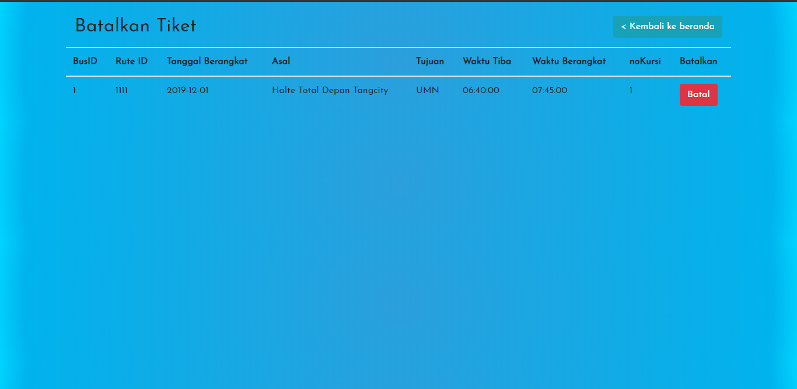
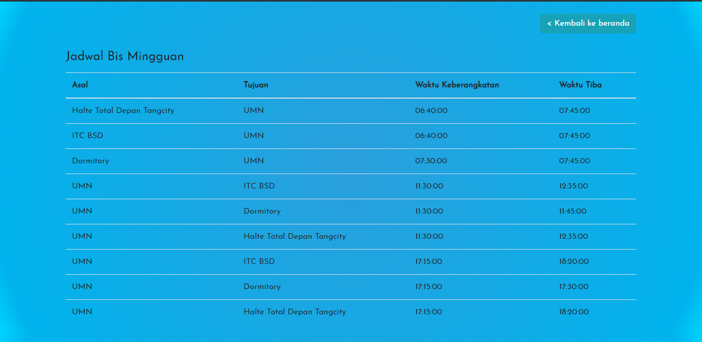

# U-Bus

## Fitur
- Login (sesuai NIM/ID)
- Memesan tiket
- Melihat tiket
- Membatalkan tiket

## Instalasi
- Download semua file
- Taruh di htdocs XAMPP
- Buat database dengan nama "umn-bus-baru" di MySQL Server
- Import SQL File dari folder database (gunakan yang umn-bus-baru)

## Documentation
- Login Page

- Beranda

- Pesan Tiket

- Digital Ticket

- Lihat Tiket

- Batalkan Tiket

- Jadwal Bus

#### <i>Major Update<i>

